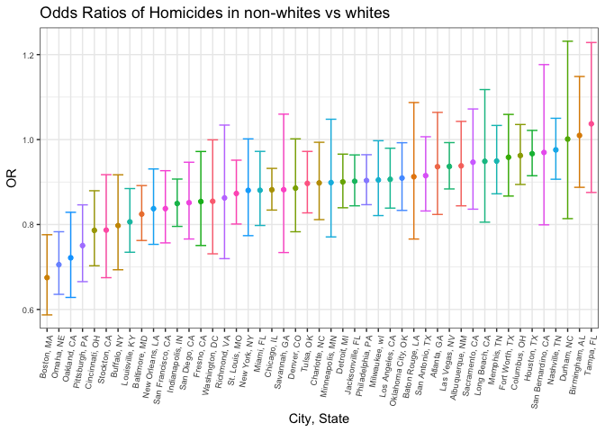

P8105\_hw6\_jih2119
================
Justin Hsie
11/21/2018

Setup

``` r
library(tidyverse)
```

Tidy data

``` r
hom_data = read_csv("data/homicide-data.csv") %>% 
  unite(city_state, city:state, sep = ", ") %>% 
  mutate(solved = 
           if_else(disposition == "Closed by arrest", 1, 0)) 
  omit = c("Dallas, TX", "Phoenix, AZ", "Kansas City, MO", "Tulsa, AL")
hom_data = filter(hom_data, !city_state %in% omit) %>% 
  mutate(victim_race = 
           if_else(victim_race == "White", "white", "non-white"),
         victim_race = fct_relevel(victim_race, "white"), 
         victim_age = as.numeric(victim_age))
```

``` r
balt_data = hom_data %>% 
  filter(city_state == "Baltimore, MD")
hom_glm_balt = 
  glm(solved ~ victim_age + victim_sex + victim_race, data = balt_data,
      family = binomial()) %>%
  broom::tidy() %>% 
  mutate(OR = exp(estimate),
         conf_low = exp(estimate - std.error * 1.96),
         conf_high = exp(estimate + std.error * 1.96)) %>% 
  select(term, log_OR = estimate, OR, conf_low, conf_high) %>% 
  knitr::kable()
hom_glm_balt
```

| term                  |     log\_OR|         OR|  conf\_low|  conf\_high|
|:----------------------|-----------:|----------:|----------:|-----------:|
| (Intercept)           |   1.1860305|  3.2740589|  2.0671700|   5.1855735|
| victim\_age           |  -0.0069900|  0.9930344|  0.9867043|   0.9994050|
| victim\_sexMale       |  -0.8877869|  0.4115656|  0.3152280|   0.5373452|
| victim\_racenon-white |  -0.8195997|  0.4406080|  0.3129079|   0.6204234|

``` r
cities_data = hom_data %>% 
  group_by(city_state) %>% 
  nest() %>% 
  mutate(models = map(data, ~glm(
            solved ~ victim_age + victim_sex + victim_race, 
            data = .x)),
         models = map(models, broom::tidy)) %>% 
  select(-data) %>% 
  unnest() %>% 
  mutate(OR = exp(estimate),
         conf_low = exp(estimate - std.error * 1.96),
         conf_high = exp(estimate + std.error * 1.96)) %>% 
  select(city_state, term, log_OR = estimate, OR, conf_low, conf_high) %>%   filter(term == "victim_racenon-white")
```

``` r
ggplot(cities_data, 
       aes(reorder(city_state, 
                   OR), OR, 
           color = city_state)) + 
  geom_point() +
  geom_errorbar(aes(ymin = conf_low, ymax = conf_high)) +
  theme_bw() +
  theme(legend.position = "") +
  theme(axis.text.x = element_text(angle = 80, hjust = 1)) +
  theme(axis.text = element_text(size = 7)) +
  labs(
    title = "Odds Ratios of Homicides in non-whites vs whites",
    x = "City, State",
    y = "OR")
```



Boston, MA has the lowest odds ratio while Tampa, FL has the highest odds ratio. All odds ratios are below one except for Durham, NC, Birmingham, AL, and Tampa, FL. This means that victims who are non-white are less likely to have their homicide resolved, with exception to the three cities mentioned.
