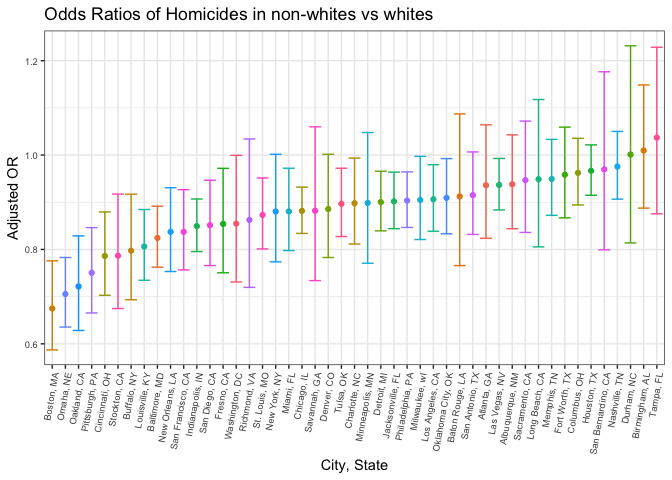
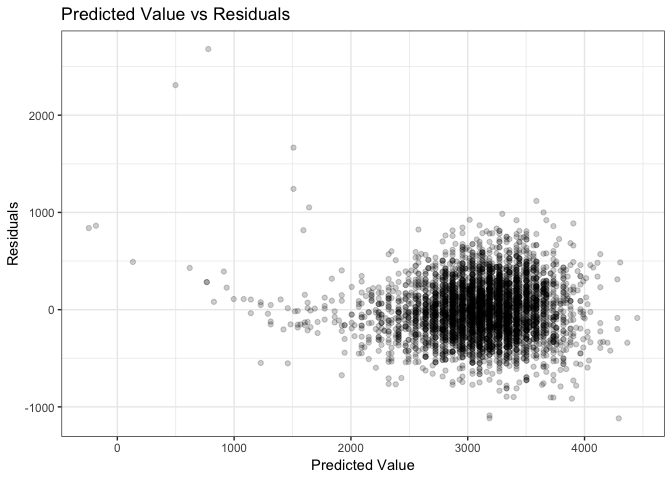
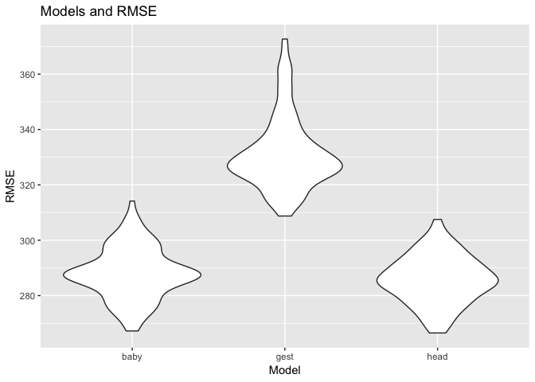

P8105\_hw6\_jih2119
================
Justin Hsie
11/21/2018

#### Setup

``` r
library(tidyverse)
library(modelr)
```

### Problem 1

#### Tidy data

``` r
hom_data = read_csv("data/homicide-data.csv") %>% 
  unite(city_state, city:state, sep = ", ") %>% 
  mutate(solved = 
           if_else(disposition == "Closed by arrest", 1, 0)) 
  omit = c("Dallas, TX", "Phoenix, AZ", "Kansas City, MO", "Tulsa, AL")
hom_data = filter(hom_data, !city_state %in% omit) %>% 
  mutate(victim_race = 
           if_else(victim_race == "White", "white", "non-white"),
         victim_race = fct_relevel(victim_race, "white"), 
         victim_age = as.numeric(victim_age))
```

#### Baltimore Data

``` r
balt_data = hom_data %>% 
  filter(city_state == "Baltimore, MD")
hom_glm_balt = 
  glm(solved ~ victim_age + victim_sex + victim_race, data = balt_data,
      family = binomial()) %>%
  broom::tidy() %>% 
  mutate(OR = exp(estimate),
         conf_low = exp(estimate - std.error * 1.96),
         conf_high = exp(estimate + std.error * 1.96)) %>% 
  select(term, log_OR = estimate, OR, conf_low, conf_high) %>% 
  knitr::kable()
hom_glm_balt
```

| term                  |     log\_OR|         OR|  conf\_low|  conf\_high|
|:----------------------|-----------:|----------:|----------:|-----------:|
| (Intercept)           |   1.1860305|  3.2740589|  2.0671700|   5.1855735|
| victim\_age           |  -0.0069900|  0.9930344|  0.9867043|   0.9994050|
| victim\_sexMale       |  -0.8877869|  0.4115656|  0.3152280|   0.5373452|
| victim\_racenon-white |  -0.8195997|  0.4406080|  0.3129079|   0.6204234|

#### All cities

``` r
cities_data = hom_data %>% 
  group_by(city_state) %>% 
  nest() %>% 
  mutate(models = map(data, ~glm(
            solved ~ victim_age + victim_sex + victim_race, 
            data = .x)),
         models = map(models, broom::tidy)) %>% 
  select(-data) %>% 
  unnest() %>% 
  mutate(OR = exp(estimate),
         conf_low = exp(estimate - std.error * 1.96),
         conf_high = exp(estimate + std.error * 1.96)) %>% 
  select(city_state, term, log_OR = estimate, OR, conf_low, conf_high) %>%   filter(term == "victim_racenon-white")
```

#### All cities plot

``` r
ggplot(cities_data, 
       aes(reorder(city_state, 
                   OR), OR, 
           color = city_state)) + 
  geom_point() +
  geom_errorbar(aes(ymin = conf_low, ymax = conf_high)) +
  theme_bw() +
  theme(legend.position = "") +
  theme(axis.text.x = element_text(angle = 80, hjust = 1)) +
  theme(axis.text = element_text(size = 7)) +
  labs(
    title = "Odds Ratios of Homicides in non-whites vs whites",
    x = "City, State",
    y = "Adjusted OR")
```



Boston, MA has the lowest odds ratio while Tampa, FL has the highest odds ratio. All odds ratios are below one except for Durham, NC, Birmingham, AL, and Tampa, FL. This means that victims who are non-white are less likely to have their homicide resolved, with exception to the three cities mentioned.

### Problem 2

#### Tidy data

``` r
baby = read_csv("data/birthweight.csv") %>% 
  mutate(babysex = as.factor(babysex),
         frace = as.factor(frace),
         malform = as.factor(malform),
         mrace = as.factor(mrace))
```

#### Regression Model

Here I use stepwise regression to find influential predictors.

``` r
baby_fullglm = glm(bwt ~ ., data = baby)
baby_step = step(baby_fullglm, direction = "backward", trace = 0) %>% 
  broom::tidy() %>% 
  knitr::kable()
baby_step
```

| term        |       estimate|    std.error|   statistic|    p.value|
|:------------|--------------:|------------:|-----------:|----------:|
| (Intercept) |  -6098.8219113|  137.5463421|  -44.340124|  0.0000000|
| babysex2    |     28.5580171|    8.4548958|    3.377690|  0.0007374|
| bhead       |    130.7770408|    3.4465672|   37.944144|  0.0000000|
| blength     |     74.9471109|    2.0190479|   37.120027|  0.0000000|
| delwt       |      4.1067316|    0.3920592|   10.474775|  0.0000000|
| fincome     |      0.3180229|    0.1747477|    1.819898|  0.0688436|
| gaweeks     |     11.5924873|    1.4620657|    7.928842|  0.0000000|
| mheight     |      6.5940377|    1.7848817|    3.694383|  0.0002231|
| mrace2      |   -138.7924801|    9.9070869|  -14.009414|  0.0000000|
| mrace3      |    -74.8867755|   42.3146313|   -1.769761|  0.0768374|
| mrace4      |   -100.6781427|   19.3246910|   -5.209819|  0.0000002|
| parity      |     96.3046933|   40.3362158|    2.387549|  0.0170038|
| ppwt        |     -2.6755853|    0.4273585|   -6.260752|  0.0000000|
| smoken      |     -4.8434197|    0.5855757|   -8.271210|  0.0000000|

Because there are still too many predictors, I will choose to keep bhead, parity, and blength because of the large coefficients.

``` r
baby_glm = glm(bwt ~ bhead + parity + blength, data = baby)
baby %>% 
  add_predictions(baby_glm) %>% 
  add_residuals(baby_glm) %>% 
  ggplot(aes(x = pred, y = resid)) +
    geom_point(alpha = 0.2) +
    theme_bw() +
    theme(legend.position = "") +
    labs(
    title = "Predicted Value vs Residuals",
    x = "Predicted Value",
    y = "Residuals")
```



The data are clumped together between 2500 and 4000 for predicted value and around 0 for residuals. For it to be a good model, the data should be spread across evenly across predicted values around a 0 residual value.

#### Cross Validation

##### Models

``` r
gest_glm = glm(bwt ~ blength + gaweeks, data = baby)
head_glm = glm(bwt ~ bhead + blength + babysex + 
                 bhead * blength + bhead * babysex + blength * babysex
               + bhead * blength * babysex, data = baby)
```

##### Cross validation and RMSE

``` r
cv = 
  crossv_mc(baby, 100) %>% 
  mutate(baby_glm = map(train, ~lm(bwt ~ bhead + parity + blength, 
                                   data = .x)),
         gest_glm = map(train, ~lm(bwt ~ blength + gaweeks, data = .x)),
         head_glm = map(train, ~lm(bwt ~ bhead + blength + babysex + 
                 bhead * blength + bhead * babysex + blength * babysex
               + bhead * blength * babysex, data = baby))) %>% 
  mutate(rmse_baby = map2_dbl(baby_glm, test, ~rmse(model = .x, 
                                                   data = .y)),
         rmse_gest = map2_dbl(gest_glm, test, ~rmse(model = .x, 
                                                      data = .y)),
         rmse_head = map2_dbl(head_glm, test, ~rmse(model = .x, 
                                                      data = .y)))
```

##### RMSE plot

``` r
cv %>% 
  select(starts_with("rmse")) %>% 
  gather(key = model, value = rmse) %>% 
  mutate(model = str_replace(model, "rmse_", ""),
         model = fct_inorder(model)) %>% 
  ggplot(aes(x = model, y = rmse)) + geom_violin() +
  labs(
    title = "Models and RMSE",
    x = "Model",
    y = "RMSE")
```



The plot shows that the model with head circumference, length, sex, and all interactions seems to be pretty similar to my model with head circumference, length, and parity. Both models have low RMSE. The model with gestational age and length was the worst with the highest RMSE.
